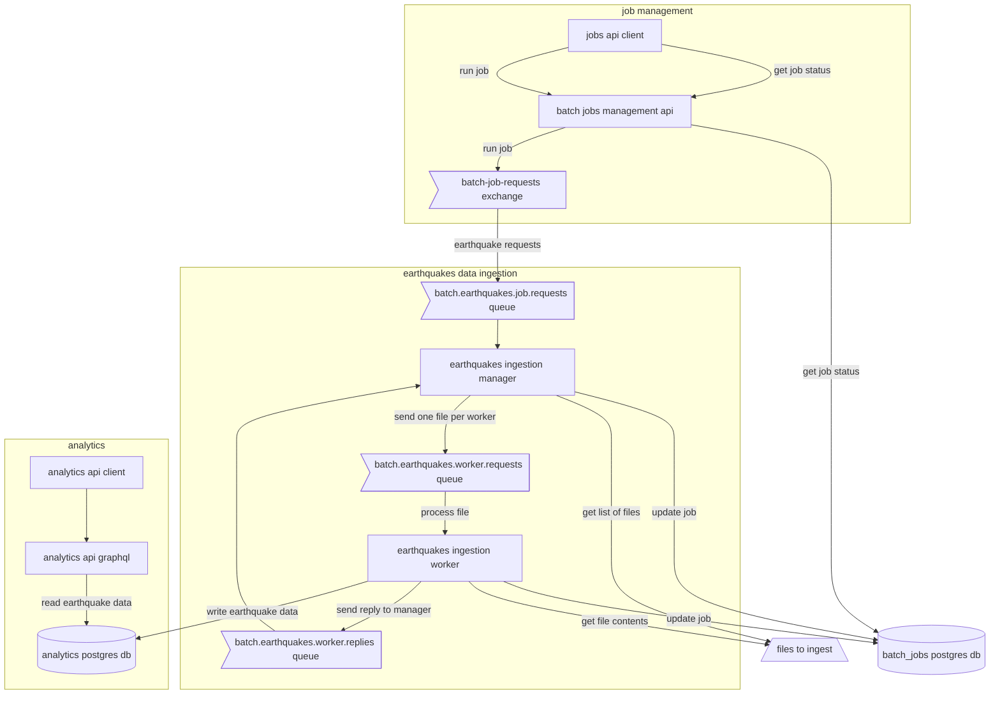
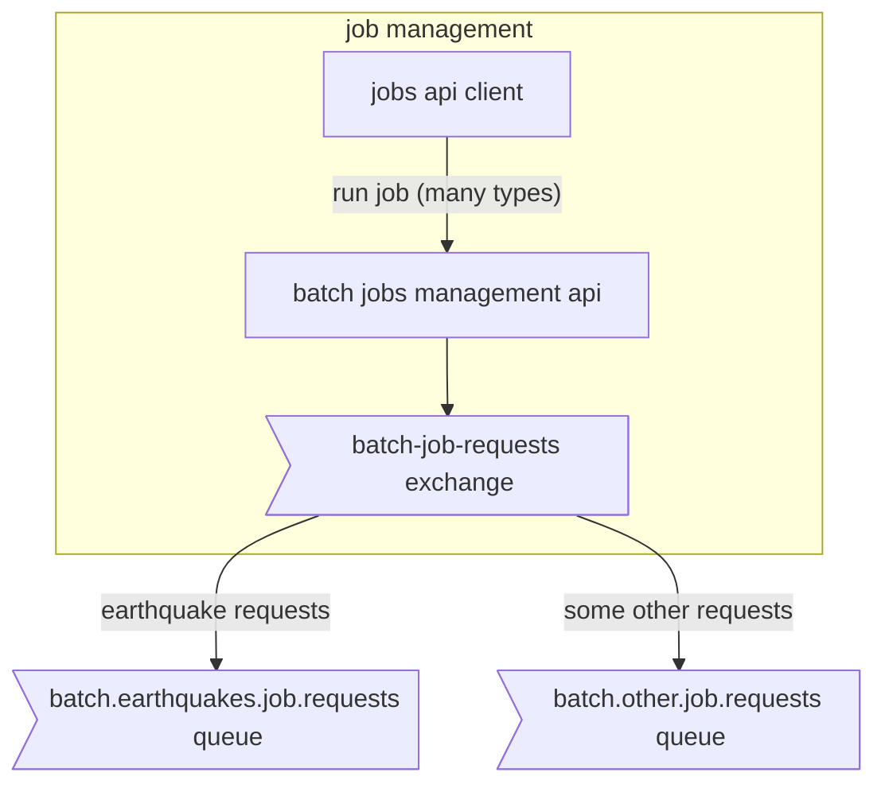
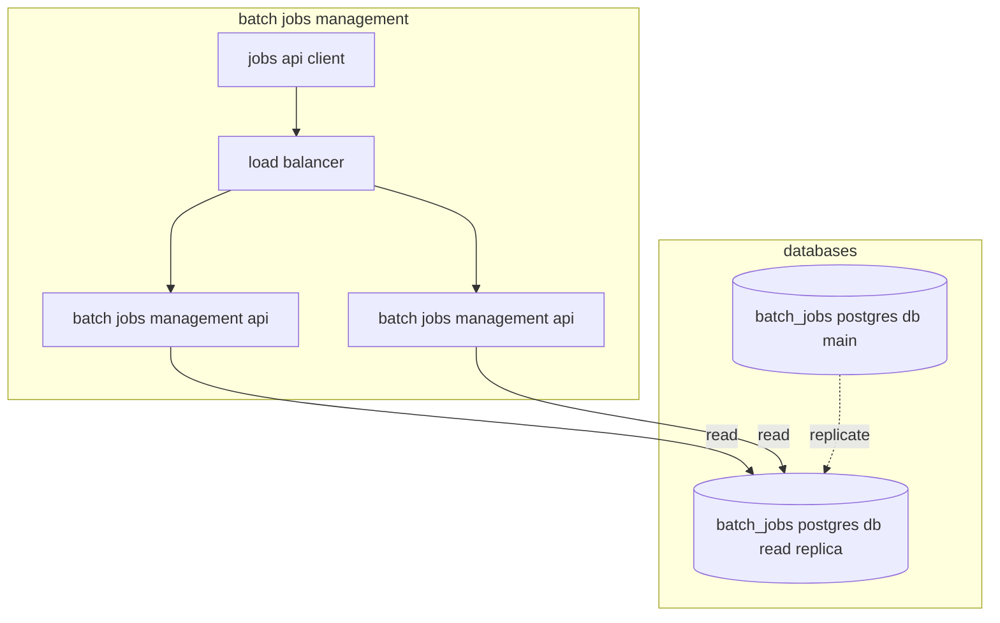
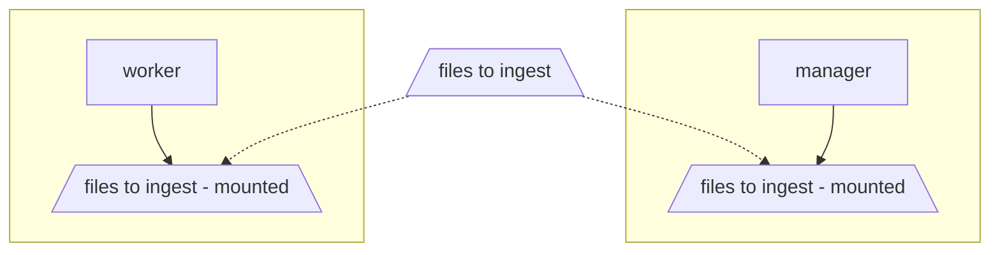
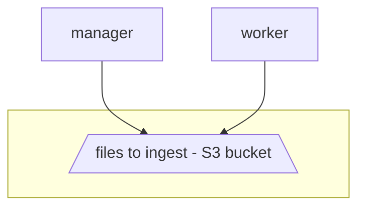

# Scalable Architecture to Ingest Data

This repository implements a scalable data pipeline that:

- Ingests earthquake data from CSV files into a PostgreSQL database
- Provides a GraphQL API for accessing the data with advanced features like filtering, sorting, and pagination
- Supports distributed processing for handling large-scale data ingestion

<!-- START doctoc -->
<!-- END doctoc -->

## Running Locally

### Environment Variables

The application requires these environment variables (set your own values for each):

Database Credentials:
- ANALYTICS_DB_USER and ANALYTICS_DB_PASSWORD: For the Analytics PostgreSQL database
- BATCH_DB_USER and BATCH_DB_PASSWORD: For the Spring Batch information PostgreSQL database

Message Queue Credentials:
- RABBIT_USER and RABBIT_PASSWORD: For RabbitMQ connection

Additional Configuration:
- SPRING_AMQP_DESERIALIZATION_TRUST_ALL=true: Required for Spring Batch

Consider using [direnv](https://direnv.net/) combined with a `.envrc` file to configure these environment variables easily. Make a copy of `.envrc.example` to get started.

### Ports

The following ports are used by the system:

- 5433
- 5434
- 5672
- 15672
- 8077-8090

Make sure these ports are available or change them in the `docker-compose.yml` file.

### Prerequisites

- Java 21
- Docker Desktop
- Docker Compose

### Build and Run

Run the `shipit` script.

```shell
./shipit.sh
```

The shipit.sh script runs tests in memory and builds container images for the following applications:

- Analytics API
- Batch Jobs Management API
- Earthquakes Data Ingestion Manager Application
- Earthquakes Data Ingestion Worker Application

It deploys the following containers to the local docker engine using Docker Compose:

- Postgres server for Batch Jobs Management data
- Postgres server for Analytics data
- RabbitMQ server
- Two instances of the Worker application
- The Manager application
- The Batch Jobs Management API
- The Analytics API

And finally, it runs an end-to-end test against the deployed system.

To verify all containers are healthy, run the following:

```shell
docker compose ps
```

To see logs

```shell
docker compose logs <service name>
```

### Stop Application

> NOTE: Postgres and RabbitMQ are configured with ephemeral volumes; all data is gone when the containers stop.

To stop all components run:

```shell
docker compose down
```

### Ingesting Data

> NOTE: The sample commands below use [HTTPie](https://httpie.io/cli) instead of curl

To trigger the data ingestion job, call the Batch Job Management API at http://localhost:8079, indicating the data to ingest is under the directory `earthquakes` and provide your own unique job ID.

```shell
http :8079/api/jobs/earthquakes-ingestion/run dataDirectory=earthquakes jobId=test-2024-12-12-12-12
```

This Git repo contains sample files from the [USGS site](https://earthquake.usgs.gov/fdsnws/event/1/) with earthquake information. The application is configured to ingest files that start with the name `earthquake` and end in `.csv`.

The data/earthquakes directory contains the following files:

- earthquakes-1.csv
- earthquakes-2.csv
- earthquakes-3.csv
- some-other-data.csv
- temp-earthquakes-bad-missing-field.csv
- temp-earthquakes-small.csv

Running an ingestion job pointing at this directory would match only the first 3 files. Feel free to rename the files to start with the word `earthquake` and end with `.csv` to process different combinations of files on each run.

#### Job Status

To check for the job status, run the following:

```shell
http :8079/api/jobs/test-2024-12-12-12-12/status
```

#### Failed Jobs

When troubleshooting failed jobs, use the command below to get failure details:

```shell
http :8079/api/execution-failures/{execution-id-from-job-status}
```

### Accessing Data via the Analytics GraphQL API

GraphiQL is available at http://localhost:8077/graphiql

#### Get earthquake count

```graphql
query {
  earthquakesCount
}
```

response

```json
{
  "data": {
    "earthquakesCount": 410608
  }
}
```

#### Query earthquakes

The API implements the [GraphQL Cursor Connections specification](https://relay.dev/graphql/connections.htm) to paginate through the results.

```graphql
{
    earthquakes(
        filter: {startTime: "2018-09-18T12:40:56.96Z", minMagnitude: 4.0}
        sort: {field: MAGNITUDE, direction: DESC}
        last: 2
    ) {
        edges {
            cursor
            node {
                id
                time
                magnitude
                place
                country
                tsunami
            }
        }
        pageInfo {
            hasNextPage
            hasPreviousPage
            startCursor
            endCursor
        }
        totalCount
    }
}
```

response

```json
{
  "data": {
    "earthquakes": {
      "edges": [
        {
          "cursor": "MjM5Mjg=",
          "node": {
            "id": "23928",
            "time": "2018-09-28T10:02:43.48Z",
            "magnitude": 7.5,
            "place": "78km N of Palu, Indonesia",
            "country": "Indonesia",
            "tsunami": true
          }
        },
        {
          "cursor": "MTczOA==",
          "node": {
            "id": "1738",
            "time": "2018-10-10T20:48:20.29Z",
            "magnitude": 7,
            "place": "117km E of Kimbe, Papua New Guinea",
            "country": "Papua New Guinea",
            "tsunami": true
          }
        }
      ],
      "pageInfo": {
        "hasNextPage": false,
        "hasPreviousPage": true,
        "startCursor": "MTAyNjI=",
        "endCursor": "MTczOA=="
      },
      "totalCount": 2007
    }
  }
}
```

#### Earthquakes next page

Notice the use of the field `after`

```graphql
{
  earthquakes(
    filter: {startTime: "2018-09-18T12:40:56.96Z", minMagnitude: 5.0, country: "US"}
    sort: {field: MAGNITUDE, direction: DESC}
    first: 10
    after: "MTMwNDUw"
  ) {
    edges {
      cursor
      node {
        id
        time
        magnitude
        place
        country
        tsunami
      }
    }
    pageInfo {
      hasNextPage
      hasPreviousPage
      startCursor
      endCursor
    }
    totalCount
  }
}
```

#### Earthquake Stats

```graphql
query {
    earthquakeStats(
        filter: {
            startTime: "2011-09-18T12:40:56.96Z"
            country: "Indonesia"
        }
    ) {
        count
        averageMagnitude
        maxMagnitude
        tsunamiCount
    }
}
```

response

```json
{
  "data": {
    "earthquakeStats": {
      "count": 441,
      "averageMagnitude": 4.717687074829932,
      "maxMagnitude": 7.5,
      "tsunamiCount": 102
    }
  }
}
```

## Architecture

The primary approach is based on:

- Distributed processing using Spring Batch
- Manager/Worker using RabbitMQ for jobs partitioning
- Simple REST API for batch jobs control
- GraphQL API for accessing analytics data



### Scaling Strategies

#### Data Source Extensibility

The current implementation reads CSV files, but Spring Batch comes with a rich set of [built-in data readers](https://docs.spring.io/spring-batch/reference/readers-and-writers/item-reader-writer-implementations.html) and can be extended with custom readers if needed.

#### Horizontal Scaling

Worker nodes can scale horizontally based on queue load. When deployed to platforms like Kubernetes, you can implement auto-scaling policies to automatically adjust the number of workers based on queue depth and processing demand.

I considered other options to scale but decided that partitioning the jobs with multiple remote workers was the best choice since it is not limited by what one JVM can do. Here are some details about the other options I considered:

- **Multithreading:** Processing each file on its own thread. A single JVM always has a limited amount of CPU and memory.
- **Parallel steps:** Processing the earthquake data is straightforward and does not require multiple steps. There is little to gain from parallelizing, which is basically a single step to process a file.
- **Asynchronous processing:** This approach is helpful when the processing is slower than I/O. This is not the case with the earthquake data. Processing the file entails simple validations/transformations. Most of the time is spent reading from the file and writing to the database.
- **Remote chunking:** This technique extends asynchronous processing, allowing multiple machines to be used in parallel. Helpful when the processing of the data is CPU-intensive rather than I/O-bound. In this case, the processing is much less CPU-intensive than I/O-bound, so Remote Chunking is not a good option.

#### Message Queue Optimization

- Clustering RabbitMQ for High Availability
- Dead letter queues for failed processing

#### Database Scaling

- Read replicas for query offloading
- Database time-based partitioning

#### Caching Strategy

- Application-level cache (e.g. Caffeine)
- Distributed cache (Redis/Memcached)

#### API Scaling

- Rate limiting and throttling
- Batching and dataloader patterns
- Schema federation

### Design Challenges

#### Handling large-scale data ingestion while maintaining query performance

Separate writes and reads. Have worker nodes write into the main database and use read-replicas for queries

#### Cost Management

- Implement auto-scaling policies
- Optimize data retention policies
- Monitor resource utilization

#### Data Protection

- Encryption at rest
- Encryption in transit
- Access control policies
- Audit logging
- Authorization policies

### Current Implementation

####  1. Batch Jobs Management API

This API allows the client to trigger job runs and check the status of a job. It currently supports Earthquake Ingestion jobs but can easily be extended to manage other job types.



The Batch Jobs Management API triggers jobs asynchronously by sending a message to the `batch-job-requests` exchange in RabbitMQ. Multiple consumers can bind queues to this exchange, looking for jobs they can handle.

The main diagram above shows a subsystem to process earthquake data; similar subsystems can be created to process other types of batch jobs.

Multiple instances of this API can run behind a load balancer to handle more requests if more throughput is needed. Also, the `batch-jobs` database could scale via read replicas if the database layer needs to handle more requests.



#### 2. Earthquakes Data Ingestion Manager

This component binds a queue to the `batch-job-requests` exchange to process only earthquake jobs. When the job starts, it connects to the `batch-jobs` database to store the job information as it progresses.

The data to process is in a directory that can be accessed by this component and also the worker nodes. The current
implementation mounts this directory on both manager and worker nodes. A future implementation could use cloud storage
like S3 buckets or block storage.





The manager gets the list of files to process based on a pattern and sends one message per file to the queue `batch.earthquakes.worker.requests`. This is the mechanism to partition the work. Files are divided among workers.

The manager listens for progress via the queue `batch.earthquakes.worker.replies`, it aggregates all progress and
determines when the job is complete.

#### 3. Earthquakes Data Ingestion Worker

This component receives work from the queue `batch.earthquakes.worker.requests` and provides progress by sending messages to the queue `batch.earthquakes.worker.replies`.

When the job starts, it opens the file indicated in the message received from the manager.

Worker processes file by chunks of lines. The chunk size is configurable, currently set at 100 lines. Each chunk is processed within a transaction; if something goes wrong, that transaction is rolled back. Any previous chunks processed successfully are not affected, and the job can resume where it left off.

Processing the file in chunks helps to control the amount of memory used. The worker only adds to the heap the chunk of lines being processed.

The worker validates data, transforms it, and inserts it into the `analytics` database.

Workers can increase or decrease based on the number of files to process and the computing capacity. The current
implementation uses docker compose so scaling is manual. However, using a platform like Kubernetes would allow auto-scaling.

#### 4. Analytics GraphQL API

The Analytics API implements a few GraphQL queries that source data from the analytics database. The API is stateless
and can quickly scale to run multiple instances behind a load balancer.

Another option to scale could be adding a caching layer or adding read replicas for the analytics database.

Similar pattern to scale as the Batch Jobs Management API.

### Areas for further improvement

- Enhance the Job Management API to present failure information.
- Secure the APIs, both the Batch Job Management and Analytics APIs. Use OAuth2 with scopes to control who can do what and see what information.
- Prevent the same type of job from running at the same time.
- Add capability to schedule jobs or even better use [Spring Cloud Data Flow](https://dataflow.spring.io/features/)
- Plugin-based architecture allows workers to run different kinds of jobs. You can also use Spring Cloud Data Flow for this.
- Read replicas for the analytics database, when needed.
- Caching for analytics data, when needed.
- Add job progress monitoring.
- Observability: instrument applications, distributed tracing.
- Purge/archive older data.

## Implementation Details

This section provides in-depth information about the system's components, data structures, and technical decisions.

### The Dataset: Earthquakes

The data used comes from the [USGS API for earthquakes](https://earthquake.usgs.gov/fdsnws/event/1/), and it is formatted as a comma-separated values file. See a few lines of the file below:

```csv
alert,cdi,code,detail,dmin,felt,gap,ids,mag,magType,mmi,net,nst,place,rms,sig,sources,status,time,title,tsunami,type,types,tz,updated,url
,,37389218,https://earthquake.usgs.gov/fdsnws/event/1/query?eventid=ci37389218&format=geojson,0.008693,,85.0,",ci37389218,",1.35,ml,,ci,26.0,"9km NE of Aguanga, CA",0.19,28,",ci,",automatic,1539475168010,"M 1.4 - 9km NE of Aguanga, CA",0,earthquake,",geoserve,nearby-cities,origin,phase-data,",-480.0,1539475395144,https://earthquake.usgs.gov/earthquakes/eventpage/ci37389218
,,37389202,https://earthquake.usgs.gov/fdsnws/event/1/query?eventid=ci37389202&format=geojson,0.02003,,79.0,",ci37389202,",1.29,ml,,ci,20.0,"9km NE of Aguanga, CA",0.29,26,",ci,",automatic,1539475129610,"M 1.3 - 9km NE of Aguanga, CA",0,earthquake,",geoserve,nearby-cities,origin,phase-data,",-480.0,1539475253925,https://earthquake.usgs.gov/earthquakes/eventpage/ci37389202
,4.4,37389194,https://earthquake.usgs.gov/fdsnws/event/1/query?eventid=ci37389194&format=geojson,0.02137,28.0,21.0,",ci37389194,",3.42,ml,,ci,111.0,"8km NE of Aguanga, CA",0.22,192,",ci,",automatic,1539475062610,"M 3.4 - 8km NE of Aguanga, CA",0,earthquake,",dyfi,focal-mechanism,geoserve,nearby-cities,origin,phase-data,",-480.0,1539536756176,https://earthquake.usgs.gov/earthquakes/eventpage/ci37389194
```

**Fields:**

1. **alert**: The alert level from the [PAGER earthquake impact scale](https://earthquake.usgs.gov/data/pager/). Typical Values: “green”, “yellow”, “orange”, “red”.
2. **cdi**: The maximum reported intensity for the event. Typical values: [0.0, 10.0]
3. **code**: An identifying code assigned by - and unique from - the corresponding source for the event. Typical values: "2013lgaz", "c000f1jy", "71935551"
4. **detail**: Link to [GeoJSON detail](https://earthquake.usgs.gov/earthquakes/feed/v1.0/geojson_detail.php) feed from a [GeoJSON summary](https://earthquake.usgs.gov/earthquakes/feed/v1.0/geojson.php) feed.
5. **dmin**: Horizontal distance from the epicenter to the nearest station (in degrees). 1 degree is approximately 111.2 kilometers. In general, the smaller this number, the more reliable the calculated depth of the earthquake. Typical values: [0.4, 7.1]
6. **felt**: The total number of felt reports submitted to the [DYFI?](https://earthquake.usgs.gov/data/dyfi/) system. Typical values: [44, 843]
7. **gap**: The largest azimuthal gap between azimuthally adjacent stations (in degrees). In general, the smaller this number is, the more reliable the calculated horizontal position of the earthquake is. Typically, earthquake locations where the azimuthal gap exceeds 180 degrees have large location and depth uncertainties. Typical values: [0.0, 180.0]
8. **ids**: A comma-separated list of event IDs associated with an event. Typical values: ",ci15296281,us2013mqbd,at00mji9pf,"
9. **mag**: The magnitude of the event. Typical values: [-1.0, 10.0]
10. **magType**: The method or algorithm used to calculate the preferred magnitude for the event. Typical values: “Md”, “Ml”, “Ms”, “Mw”, “Me”, “Mi”, “Mb”, “MLg”
11. **mmi**: The maximum estimated instrumental intensity for the event. Typical values: [0.0, 10.0]
12. **net**: The ID of a data contributor. Identifies the network considered to be the preferred source of information for this event. Typical values: ak, at, ci, hv, ld, mb, nc, nm, nn, pr, pt, se, us, uu, uw
13. **nst**: The total number of seismic stations used to determine earthquake location.
14. **place**: Textual description of named geographic region near the event. This may be a city name or a Flinn-Engdahl Region name.
15. **rms**: The root-mean-square (RMS) travel time residual, in sec, using all weights. This parameter measures the fit of the observed arrival times to the predicted arrival times for this location. Smaller numbers reflect a better fit of the data. The value depends on the accuracy of the velocity model used to compute the earthquake location, the quality weights assigned to the arrival time data, and the procedure used to locate the earthquake. Typical values: [0.13,1.39]
16. **sig**: A number describing how significant the event is. Larger numbers indicate a more significant event. This value is determined by many factors, including magnitude, maximum MMI, felt reports, and estimated impact. Typical values: [0, 1000]
17. **sources**: A comma-separated list of network contributors. Typical values: ",us,nc,ci,"
18. **status**: Indicates whether a human has reviewed the event. Typical values: “automatic”, “reviewed”, “deleted”
19. **time**: Time when the event occurred. Times are reported in milliseconds since the epoch (1970-01-01T00:00:00.000Z) and do not include leap seconds.
20. **title**: Title for the event. Magnitude and place together.
21. **tsunami**: This flag is set to "1" for large events in oceanic regions and "0" otherwise.
22. **type**: Type of seismic event. Typical values: “earthquake”, “quarry”
23. **types**: A comma-separated list of product types associated with this event. Typical values: “,cap,dyfi,general-link,origin,p-wave-travel-times,phase-data,”
24. **tz**: Timezone offset from UTC in minutes at the event epicenter. Typical values: [-1200, +1200]
25. **updated**: Time when the event was most recently updated. Times are reported in milliseconds since the epoch.
26. **url**: Link to USGS Event Page for event.

### Earthquakes Query Samples

#### Earthquakes table and indexes:

```sql
CREATE TABLE earthquakes
(
    id           SERIAL PRIMARY KEY,
    time         TIMESTAMP WITH TIME ZONE NOT NULL,
    magnitude    DECIMAL(3, 1),
    place        VARCHAR(255)             NOT NULL,
    state        VARCHAR(255),
    country      VARCHAR(255)             NOT NULL,
    tsunami      BOOLEAN                  DEFAULT false,
    significance INTEGER,
    mag_type     VARCHAR(10),
    event_type   VARCHAR(50)              DEFAULT 'earthquake',
    felt_reports INTEGER                  DEFAULT 0,
    cdi          DECIMAL(3, 1),
    mmi          DECIMAL(3, 1),
    alert_level  VARCHAR(10),
    source_id    VARCHAR(20)              NOT NULL,
    created_at   TIMESTAMP WITH TIME ZONE DEFAULT CURRENT_TIMESTAMP,
    updated_at   TIMESTAMP WITH TIME ZONE DEFAULT CURRENT_TIMESTAMP
);

-- Compound index for our most common query pattern: filtering by time and magnitude, sorting by time
-- The DESC ordering helps with our common DESC sorts
CREATE INDEX idx_earthquakes_time_mag ON earthquakes (time DESC, magnitude);

-- Compound index for pagination: ensures efficient keyset pagination queries
CREATE INDEX idx_earthquakes_time_id ON earthquakes (time DESC, id DESC);

-- Partial index for significant earthquakes: dramatically reduces index size while maintaining performance
-- for queries that focus on more significant earthquakes
CREATE INDEX idx_significant_earthquakes ON earthquakes (time, magnitude, country)
    WHERE magnitude >= 4.0;

-- Specialized index for tsunami-related queries. Including magnitude since it's commonly used together
CREATE INDEX idx_earthquakes_tsunami ON earthquakes (tsunami, magnitude)
    WHERE tsunami = true;

-- Covering index for frequently accessed columns: Eliminates the need to access the main table for some queries
CREATE INDEX idx_earthquakes_common_cols ON earthquakes
    (time, magnitude, country)
    INCLUDE (place, alert_level, felt_reports);

-- Materialized view to maintain good performance for recent data queries
CREATE MATERIALIZED VIEW recent_earthquakes AS
SELECT *
FROM earthquakes
WHERE time >= NOW() - INTERVAL '3 months'
WITH DATA;

CREATE INDEX idx_recent_earthquakes_mv ON recent_earthquakes (time DESC, magnitude);

-- Refresh the view periodically (via cron job or similar)
-- REFRESH MATERIALIZED VIEW recent_earthquakes;
```

#### Note on indexes:

- **Compound Indexes:** Combining frequently used columns in indexes reduces the need for index intersections and improves query performance.
- **Covering Indexes:** The `idx_earthquakes_common_cols` index includes (INCLUDE) additional columns that are frequently retrieved. This allows Postgres to satisfy some queries entirely from the index without touching the main table.
- **Partial Indexes:** By creating indexes that only include rows matching certain conditions (like magnitude >= 4.0), we reduce the index size and improve maintenance performance while still maintaining fast queries for essential data.
- **DESC Ordering:** By explicitly creating descending indexes, we avoid index scanning in reverse, improving performance for our typical ORDER BY time DESC queries.

Also, it is crucial to perform regular maintenance on the indexes. The query below shows vital index statistics:

- **idx_scan:** The number of times this index has been used for scanning. A low number might indicate an underused index.
- **idx_tup_read:** The number of index entries returned by scans. If this is much higher than idx_tup_fetch, it might indicate an inefficient index.
- **idx_tup_fetch:** The number of table rows fetched by using the index. This helps us understand how selective the index is.

Consider dropping indexes that show very low usage after a few months of monitoring. Also, remember to `ANALYZE` the table after significant data changes to ensure the query planner has up-to-date statistics.

```sql
-- Regular maintenance to keep indexes efficient
ANALYZE earthquakes;

-- Monitor index usage
SELECT schemaname,
       relname,
       indexrelname,
       idx_scan,
       idx_tup_read,
       idx_tup_fetch
FROM pg_stat_user_indexes
WHERE relname = 'earthquakes'
ORDER BY idx_scan DESC;
```

#### Sample Queries:

Find recent large earthquakes that may have caused tsunamis using the compound index on time for efficient sorting. Adding a magnitude filter first helps Postgres narrow down rows before sorting:

```sql
SELECT time,
       magnitude,
       place,
       country,
       tsunami,
       alert_level
FROM earthquakes
WHERE magnitude >= 7.0
  AND time >= NOW() - INTERVAL '10 years'
ORDER BY time DESC
LIMIT 10;
```

Query using the covering index that can be satisfied entirely from `idx_earthquakes_common_cols`:

```sql
SELECT 
    time,
    magnitude,
    country,
    place,
    alert_level,
    felt_reports
FROM earthquakes
WHERE 
    time >= NOW() - INTERVAL '10 years'
    AND magnitude >= 4.0
ORDER BY time DESC
LIMIT 100;
```

Analyze earthquake frequency and average magnitude by country, including only significant events to improve data quality. Using country index for grouping:

```sql
SELECT country,
       COUNT(*)                                   as earthquake_count,
       ROUND(AVG(magnitude)::numeric, 2)          as avg_magnitude,
       COUNT(CASE WHEN tsunami = true THEN 1 END) as tsunami_count
FROM earthquakes
WHERE magnitude >= 4.0
  AND time >= NOW() - INTERVAL '10 years'
GROUP BY country
HAVING COUNT(*) >= 10
ORDER BY earthquake_count DESC
LIMIT 20;
```

Analyze earthquake patterns by the hour of the day using the time index for efficient data extraction, demonstrating window functions for running averages.

```sql
WITH hourly_stats AS (
    SELECT EXTRACT(HOUR FROM time) as hour_of_day,
           COUNT(*)                as event_count,
           AVG(magnitude)          as avg_magnitude
    FROM earthquakes
    WHERE magnitude >= 3.0
      AND time >= NOW() - INTERVAL '10 years'
    GROUP BY EXTRACT(HOUR FROM time))
SELECT hour_of_day,
       event_count,
       ROUND(avg_magnitude::numeric, 2) as avg_magnitude,
       ROUND(AVG(avg_magnitude) OVER (
           ORDER BY hour_of_day
           ROWS BETWEEN 2 PRECEDING AND 2 FOLLOWING
           )::numeric, 2)               as rolling_avg_magnitude
FROM hourly_stats
ORDER BY hour_of_day;
```

Efficient pagination using keyset pagination is more scalable than OFFSET for large datasets. Using compound sorting for uniqueness

```sql
SELECT id,
       time,
       magnitude,
       place,
       country,
       felt_reports
FROM earthquakes
WHERE magnitude >= 5.0
  -- Last row from the previous page
  AND (time, id) < ('2018-10-10 20:59:01'::timestamptz, 1730)
ORDER BY time DESC, id DESC
LIMIT 20;
```

Comprehensive analysis of earthquake impacts by region, using multiple aggregations and conditional logic. Leveraging indexes on country and magnitude:

```sql
WITH significant_events AS (SELECT country,
                                   COUNT(*)                                              as total_events,
                                   COUNT(CASE WHEN tsunami THEN 1 END)                   as tsunami_events,
                                   MAX(magnitude)                                        as max_magnitude,
                                   AVG(CASE WHEN felt_reports > 0 THEN felt_reports END) as avg_felt_reports
                            FROM earthquakes
                            WHERE time >= NOW() - INTERVAL '10 years'
                              AND magnitude >= 4.5
                            GROUP BY country),
     ranked_countries AS (SELECT *,
                                 RANK() OVER (ORDER BY total_events DESC)  as event_rank,
                                 RANK() OVER (ORDER BY max_magnitude DESC) as magnitude_rank
                          FROM significant_events
                          WHERE total_events >= 5)
SELECT country,
       total_events,
       tsunami_events,
       max_magnitude,
       ROUND(avg_felt_reports::numeric, 0) as avg_felt_reports,
       event_rank,
       magnitude_rank
FROM ranked_countries
WHERE event_rank <= 20
   OR magnitude_rank <= 20
ORDER BY total_events DESC;
```

### Data Integrity and Validation

Using Spring Batch helps a great deal when it comes to making sure ingested data is valid.

Because the application uses `FlatFileItemReader` the process stops immediately if there is any problem opening the source file or the file structure is not the expected one. This can be relaxed, but this implementation is strict.

The usage of `CompositeItemProcessor` allows the chain of multiple validation and processing steps. See [Validation and Transformation Tests](#validation-and-transformation-tests) section below for more details.

Spring Batch allows to configure fault tolerance. For example, allow up to 10 validation/processing errors. This implementation is configured as `strict` with zero tolerance. Sometimes, fixing the problem in the source file and ensuring all records get ingested correctly is more straightforward than dealing with incomplete data.

Spring Batch's `JdbcBatchItemWriter` performs batch inserts for better performance and maintains transaction boundaries at the chunk level. If any record in a chunk fails, the entire chunk is rolled back. The job's metadata tables track the execution state for restart capability.

### Tests

#### End-to-End Test

There is one [end-to-end test](job-mgmt-api/src/test/java/com/vasquezhouse/batch/job_mgmt_api/EndToEndTest.java#L27) that runs against the deployed system and verifies all components are correctly configured. This test runs at the end of the [shipit script](shipit.sh). The test performs the following steps:

- Creates 3 files with earthquake data to process
- Gets the current number of earthquakes in the database by calling the Analytics API
- Triggers an ingestion job by calling the Batch Job Management API
- Polls the Batch Job Management API until the job is completed
- Verifies the job completion information, including the number of workers that processed the job, which is expected to be more than 1. The application is configured to run 2 workers.
- Calls the Analytics API again to get the new number of earthquakes in the database and verifies it increases by the expected number (9,332)

#### Data Reader Tests

Spring Batch makes separating reading, processing, and writing operations in a batch job easy. Reading data is implemented in [ItemReaderConfig](worker/src/main/java/com/vasquezhouse/batch/earthquakes/ingestion/worker/configuration/ItemReaderConfig.java) and tested with [ItemReaderTest](worker/src/test/java/com/vasquezhouse/batch/earthquakes/ingestion/worker/ItemReaderTest.java) by creating a small sample file in a temporary directory and pointing the reader at it.

#### Validation and Transformation Tests

The validation logic is implemented using [Spring Java Bean Validation](https://docs.spring.io/spring-framework/reference/core/validation/beanvalidation.html), see the class [UsgsEarthquake](worker/src/main/java/com/vasquezhouse/batch/earthquakes/ingestion/worker/domain/UsgsEarthquake.java) for details.

Transformation logic is implemented in [ItemProcessorConfig](worker/src/main/java/com/vasquezhouse/batch/earthquakes/ingestion/worker/configuration/ItemProcessorConfig.java).

Validations and transformations are tested with the tests in [ItemProcessorTest](worker/src/test/java/com/vasquezhouse/batch/earthquakes/ingestion/worker/ItemProcessorTest.java).

#### Data Writer Tests

Writing data to the analytics database is implemented in the class [ItemWriterConfig](worker/src/main/java/com/vasquezhouse/batch/earthquakes/ingestion/worker/configuration/ItemWriterConfig.java) and tested with [ItemWriterTest](worker/src/test/java/com/vasquezhouse/batch/earthquakes/ingestion/worker/ItemWriterTest.java). These tests use Testcontainers to verify writes against an actual Postgres database.

### Technology Stack

The application was implemented using the following technologies:

- [direnv](https://direnv.net/)
- [Dockerfile](https://docs.docker.com/reference/dockerfile/)
- [Docker Compose](https://docs.docker.com/compose/)
- [Docker Desktop](https://www.docker.com/products/docker-desktop/)
- [Flyway](https://www.red-gate.com/products/flyway/)
- [HTTPie](https://httpie.io/cli)
- [Postgres](https://www.postgresql.org/)
- [RabbitMQ](https://www.rabbitmq.com/)
- [Spring Batch](https://spring.io/projects/spring-batch)
- [Spring Boot](https://spring.io/projects/spring-boot)
- [Spring Data JPA](https://spring.io/projects/spring-data-jpa)
- [Spring for GraphQL](https://spring.io/projects/spring-graphql)
- [Spring Java Bean Validation](https://docs.spring.io/spring-framework/reference/core/validation/beanvalidation.html)
- [Spring Integration](https://spring.io/projects/spring-integration)
- [Testcontainers](https://docs.spring.io/spring-boot/reference/testing/testcontainers.html)
