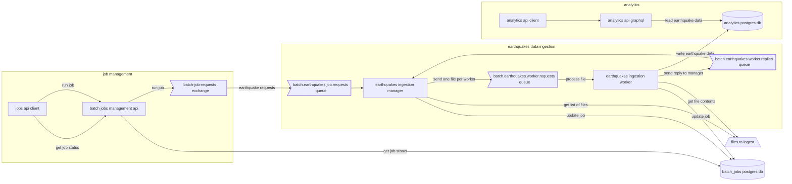

```mermaid
flowchart LR
    api-analytics[analytics api graphql]
    api-client[jobs api client]
    api-client-analytics[analytics api client]
    api-job-mgmt[batch jobs management api]
    batch-job-requests>batch-job-requests exchange]
    dir-data[/files to ingest\]
    db-batch-jobs[(batch_jobs postgres db)]
    db-analytics[(analytics postgres db)]
    manager[earthquakes ingestion manager]
    queue-job-requests-earthquakes>batch.earthquakes.job.requests queue]
    queue-worker-requests>batch.earthquakes.worker.requests queue]
    queue-worker-replies>batch.earthquakes.worker.replies queue]
    worker[earthquakes ingestion worker]

    api-job-mgmt -- get job status --> db-batch-jobs
    batch-job-requests -- earthquake requests --> queue-job-requests-earthquakes
    worker -- update job --> db-batch-jobs
    manager -- update job --> db-batch-jobs
    manager -- get list of files --> dir-data
    worker -- get file contents --> dir-data    
    
    subgraph job management
        api-client -- get job status --> api-job-mgmt
        api-client -- run job --> api-job-mgmt
        api-job-mgmt -- run job --> batch-job-requests
    end
    
    subgraph earthquakes data ingestion
        queue-job-requests-earthquakes --> manager
        manager -- send one file per worker --> queue-worker-requests
        queue-worker-requests -- process file --> worker
        queue-worker-replies --> manager
        worker -- send reply to manager --> queue-worker-replies    
    end
    
    subgraph analytics
        worker -- write earthquake data --> db-analytics
        api-client-analytics --> api-analytics
        api-analytics -- read earthquake data --> db-analytics    
    end
```
